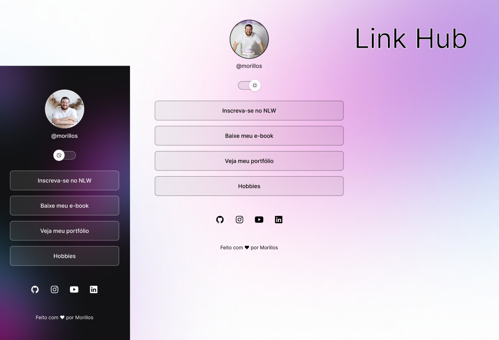

<h1 align="center"> Link Hub </h1>

 Agregador de links pessoais para projetos e redes socias

    <a href="# tecnologias">Tecnologias</a>&nbsp;&nbsp;&nbsp;|&nbsp;&nbsp;&nbsp;
    <a href="# projeto">Projeto</a>&nbsp;&nbsp;&nbsp;|&nbsp;&nbsp;&nbsp;
    <a href="# licença">Licença</a>

 

 
    

## Tecnologias

Esse Projeto foi desenvolvido com as seguintes tecnologias:

- HTML e CSS
- JavaScript
- Git e Github
- Figma

## Projeto

O link Hub é um agregador de links para usar como cartão de visitas online.
Ter um local com todos seus projetos, sites e redes socias em um único lugar, simples e prático.

## Licença

Esse projeto está sob licença MIT.

---

Feito com ♥ por Morillos. Seguindo os passos do curso Discover da RocketSeat.